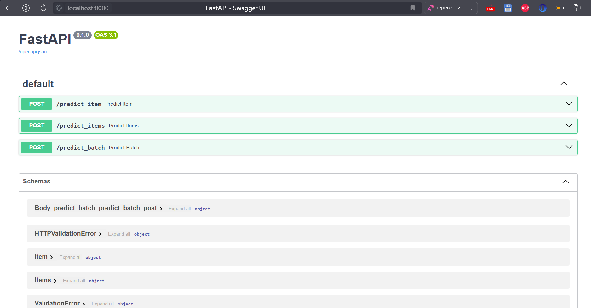
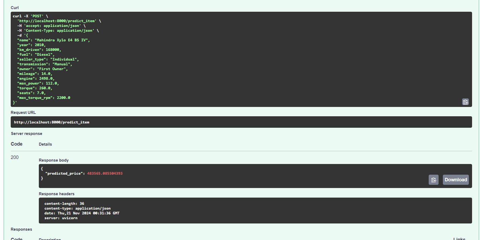
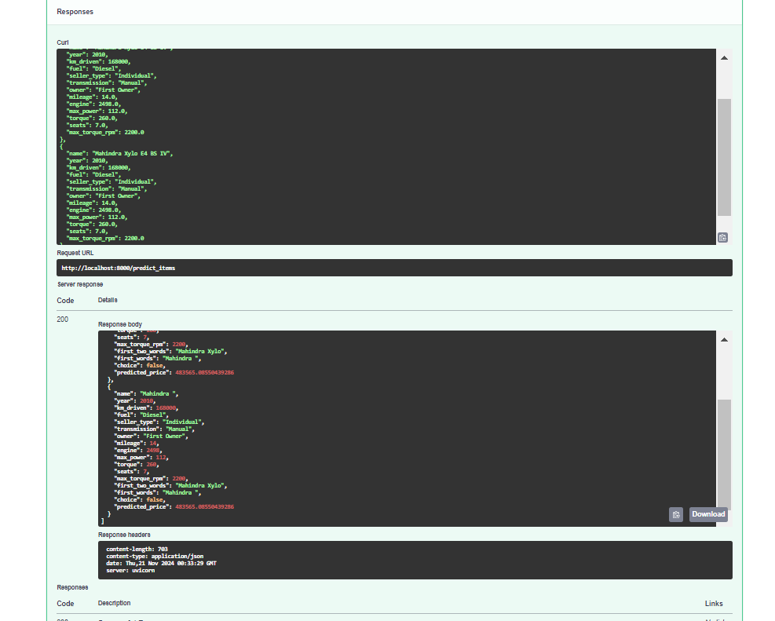
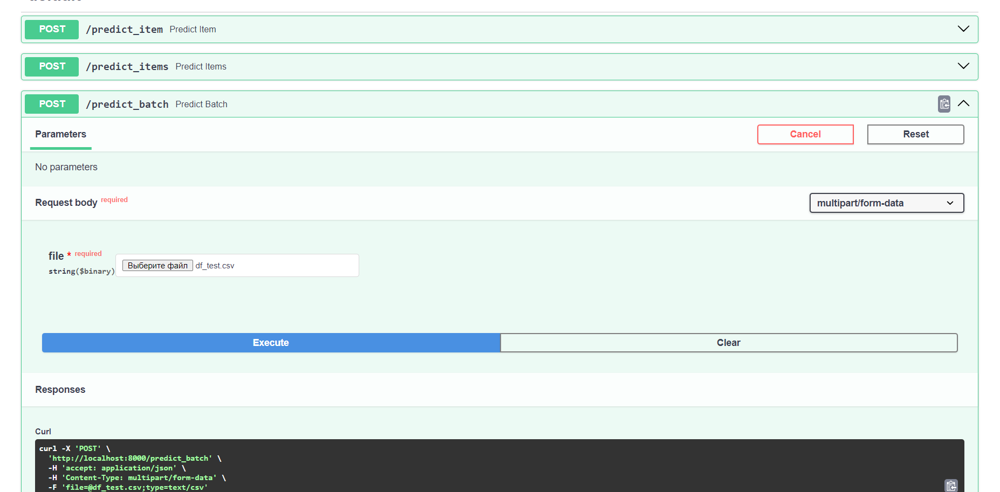

# EDA

Для начала мы сделали предобработку, в коде `.ipynb` файла с помощью pandas. Мы преобразовали некоторые текстовые столбцы в числовые. В основном использовали регулярные выражения, чтоб можно было проще отлавливать ошибки при обработке, а также есть сложный столбец `torque`, который мы успешно обработали, не забыв перевести в нужные единицы измерения.

Также мы удалили все полные дубликаты, и заполнили пустые строчки медианными значениями, чтоб распределение не сильно сдвинулось из-за этого действия.

# Эксперименты с моделями

1. Для начала мы проэксперементировали с линейной регрессией используя только вещественные параметры, также проверили, как поменяется качество модели с точки зрения метрики качества $r^2$, что произойдет с результатом при добавление регуляризации и нормализации столбцов.
Также увидели небольшое улучшение качества на тестовой выборке при использование `gridsearch` и техники кросс-валидации.

2. Затем мы использовали One-Hot-Encoding, чтоб закодировать категориальные фичи, не забыв из каждого столбца для которого мы делали эту процедуру убрать один класс, чтоб не было линейно связанных частей в модели

Использование категориальных фичей сильно улучшило качество модели при поиске по сетке в моделе ridge с кросс валидацией.
3. Была попытка добавить дополнительные нелинейные фичи к примеру $year^2$ и $\frac{1}{km_driven}$. Но сильного улучшения качества не было заметно

# Бизнес метрики

Сначала реализовали стандартную бизнес-метрику, которая считает долю прогнозово отличающихся от реальной цены на эти авто не более, чем на 10%, получили не очень хорошие результаты, но лучше всего справилась модель в которую мы добавили новые нелинейные фичи

Аналогичный результат был для дополнительно реализованной метрики, где мы штрафовали модель с некоторым коэффициентов за недопрогноз.

Листинг функции:
```python
def your_business_metric(y_true, y_pred):
    deviation = np.abs(y_true - y_pred) / y_true
    under = (y_pred < y_true) & (deviation <= 0.10)
    over = (y_pred >= y_true) & (deviation <= 0.10)
    # Недопрогнозы учитываем с меньшим весом
    score = (np.sum(over) + 0.4 * np.sum(under)) / len(y_true)
    return score
```

# Реализация сервера

Не до конца было понятно как можно реализовать, чтоб на входе с точки зрения пользователя был ввод csv файла, а мы могли бы валидировать это как некоторую коллекцию объектов. Поэтому было реализовано 3 метода API

1. `/predict_item` - передаем json файл для одной машины
2. `/predict_items` - передаем json файл для нескольких машин, это автоматически валидируется как коллекция объектов
3. `/predict_batch` - отправляем файл csv по API и возвращаем тоже csv файл но со столбцом предсказанием

**Скриншоты работы**

## Функции которые нам доступны по API

## Predict_item

## Predict_items

## Predict_batch
Добавляем возможность обработать csv файл


# Проблемы

- Можно было написать кодирование категориальных признаков внутри модели, так было бы корректнее и пришлось бы передавать всего один `.pickle` файл, но мы обработали их в `.ipynb` ноутбуке, и не хотелось интегрировать и переписывать код
- Не реализовал $L_0$ увидел, что можно подойти используя жадный отбор признаков, но не до конца понял как реализовать.